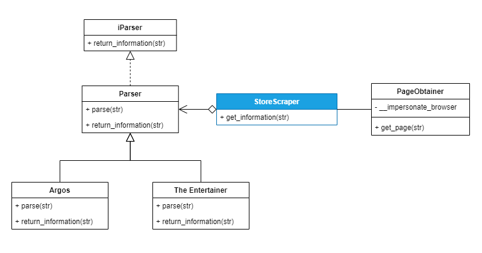

# StoreScraper
## Description
This library will allow you to scrape "basic" product information from online retailers, including the products name, price, categories and primary image.

### Suported Websites
- https://www.argos.co.uk
- https://thetoyshop.com
## Basic UML Diagram

## Usage
An example can be found in main.py

The below code scrapes two stores and prints out the results
<code>

"Example using Argos and TheEntertainer"
from ProductScraper.StoreScraper import StoreScraper

scraper = StoreScraper()

results = scraper.get_information("https://www.argos.co.uk/product/8992866")
print(results)

results = scraper.get_information("https://www.thetoyshop.com/collectibles/adult-collectibles/DC-C"
                                  "omics-30cm-Superman-Figure/p/545842?queryId=83dec2295943aff8586"
                                  "c518c6f031006"
                                  )
print(results)

</code>